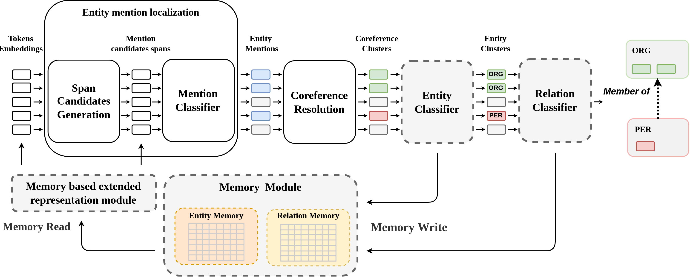

# Similarity-based Memory Enhanced Joint Entity and Relation Extraction

Official PyTorch implementation of the paper _"Similarity-based Memory Enhanced Joint Entity and
Relation Extraction"_ accepted on the
_International Conference on Computational Science 2023_.



## Setup

### Install requirements

To set up an environment first create the python `3.10` environment using `conda` or `virtualenv`,
activate it, and install
poetry using pip:

```commandline
pip install poetry==1.4.2
```

```commandline
make setup
```

**OR**

To force the CUDA version of pytorch library run the following:

```commandline
make setup-cuda
```

### Init git submodules

We built our solution based on wonderful work from [JEREX](https://github.com/lavis-nlp/jerex)
repository. We also used
the code from [Edge-oriented Graph repository](https://github.com/fenchri/edge-oriented-graph) to
process the CDR dataset. We used the code
as git submodules which You can initialize by running the following:

```commandline
git submodule init && git submodule update --recursive
```

Because we import some code from the **JEREX** It might be useful to add the `./submodules/jerex`
directory to
__PYTHONPATH__.

### Set environment variables

Create the '.env' file based on '.env.example' examples and set the variables:

- **PRETRAINED_MODELS_DIR** - The directory where the pretrained huggingface 🤗 models are stored;
- **WANDB_PROJECT_NAME** - If you want to use Weights&Biases logging You can set the project name
  used by the logger;

### Download datasets

You can download the datasets we used in our experiments in ready-to-use format:

```commandline
./scripts/datasets/fetch_datasets.sh
```

### Download pretrained models

You can download the datasets we used in our experiments in ready-to-use format:

```commandline
./scripts/fetch_models.sh
```

### Configuration

We used [Hydra](https://hydra.cc/docs/1.3/intro/) to create a hierarchical configuration for running
our experiments. The `./config` directory contains all the `.yaml` file used to run the scripts.

## Example inference

You can make use of downloaded model checkpoint and run the inference on the CDR dataset using the
following command:

```commandline
python ./scripts/run.py --config-name memory_re/cdr/test
```

All the artifacts created during run will be logged into directory created in `./storage/runs`. The
script is configured to visualize predictions in .html file (using the code from JEREX) and
visualize the memory activations for entities and mentions categories.

## Training

You can run training on the CDR dataset using the following command:

```commandline
python ./scripts/run.py --config-name memory_re/cdr/train
```
